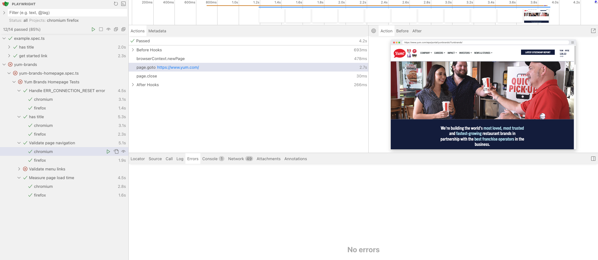

# **Playwright Automation Suite for Yum Brands**

This repository contains an end-to-end automation testing framework for Yum! Brands web applications. Built with **Playwright**, **TypeScript**, and **Cucumber**, this project showcases a modern and scalable approach to quality assurance through automation.

## **Technologies Used**

- **Playwright**: A Node.js library for end-to-end testing that supports multiple browsers (Chromium, Firefox, and WebKit). It enables reliable automation and advanced debugging features.
- **TypeScript**: A superset of JavaScript that adds static typing to improve code reliability and maintainability.
- **Cucumber (BDD)**: Behavior-Driven Development framework used for writing test cases in plain English (Gherkin syntax), ensuring clear communication between business and technical teams.
- **Node.js**: For running Playwright and managing dependencies.
- **Git**: For version control and collaboration.
- **CI/CD Integration (Optional)**: Designed to integrate seamlessly with continuous integration pipelines for automated testing in deployment workflows.

## **Features**

- **Cross-Browser Support**: Tests run on Chromium, Firefox, and WebKit to ensure broad compatibility.
- **Headless & Non-Headless Execution**: Supports running tests both in headless mode (faster) and non-headless mode (for debugging).
- **Custom Browser Contexts**: Configurable settings, such as user agents and SSL handling, for better simulation of real user scenarios.
- **BDD Test Structure**: Tests written in Gherkin syntax for readability and collaboration.
- **HTML Reporting**: Generates detailed test execution reports for analysis and debugging.

## **Project Structure**

.
├── tests/
│ ├── yum-brands/
│ │ └── yum-brands-homepage.spec.ts # Test cases for Yum Brands homepage
│ ├── tests-examples/
│ │ └── example.spec.ts # Example test cases
├── playwright.config.ts # Playwright configuration
├── package.json # Project dependencies and scripts
├── .gitignore # Ignored files and folders
└── README.md # Project documentation

## **Setup Instructions**

1. Clone the repository:

   ```bash
   git clone https://github.com/carizam/playwright-yum-brands.git
   cd playwright-yum-brands

   ```

2. Install dependencies:

   ```bash
   npm install

   ```

3. Run tests:

- Run all tests:

```
  npx playwright test
```

- Run specific test:

```
  npx playwright test tests/yum-brands/yum-brands-homepage.spec.ts

```

4. View test reports:

```
   npx playwright show-report
```

## HTML Report

Below is an example of the HTML report generated after running tests:


## **How to Add New Tests**

Create a new .spec.ts file under the tests/ directory.

Use the Playwright test syntax to define your test cases. Example:

```
import { test, expect } from '@playwright/test';

test('Test description', async ({ page }) => {
    await page.goto('https://example.com');
    expect(await page.title()).toBe('Example Title');
});
```

## Demo: Running the Project

Below is a screenshot showing the project running successfully:



Gherkin implementation:

Feature: Yum Brands Homepage

  Scenario: Handle ERR_CONNECTION_RESET error
    Given I navigate to the Yum Brands homepage
    Then I should see the page loaded successfully

  Scenario: Check homepage title
    Given I navigate to the Yum Brands homepage
    Then the page title should contain "Yum.com"

  Scenario: Validate page navigation
    Given I navigate to the Yum Brands homepage
    Then the page should load successfully

  Scenario Outline: Validate menu links navigation
    Given I navigate to the Yum Brands homepage
    When I click on the "<menu>" menu link
    Then I should be navigated to the "<url>" URL

    Examples:
      | menu     | url        |
      | Company  | /company   |
      | Careers  | /careers   |
      | Impact   | /impact    |
      | Investors| /investors |

  Scenario: Measure page load time
    Given I navigate to the Yum Brands homepage
    Then the page should load within 60000 ms


## **Contribution Guidelines**

If you'd like to contribute:

- 1.Fork the repository.
- 2.Create a feature branch.
- 3.Submit a pull request for review.

## **Contact**

For questions or support, feel free to reach out at [ciarizam@hotmail.com].
